# Laporan Praktikum  Pemrograman Mobile Pertemuan 3#
### PEngenalan Core Component dan Styling ###

## Tujuan Pembelajaran

Setelah menyelesaikan praktikum ini, mahasiswa mampu:

1. Memahami dan menggunakan **16 Core Components** React Native
2. Menerapkan **StyleSheet** untuk styling terpusat
3. Menggunakan **useState** untuk state management dasar
4. Membuat layout yang responsif dengan **Flexbox**
5. Menangani **interaksi pengguna** (tekan, input, scroll)

Langkah 1: Mengimpor Components

1. Buka file App.js pada folder ptmn2
2. Import 16 core components sebagai berikut:
3. Konfirmasi bukti
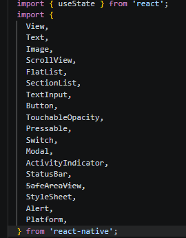

Langkah 2: Menyiapkan data Objek dan Array 
1. Membuat objek untuk menyimpan data
2. Buat objek Array bernama PROFILE
3. Konfirmasi bukti
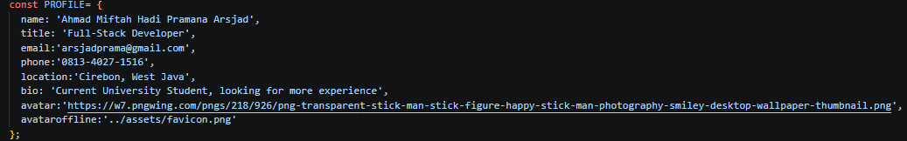
4. Membuat Objek Array SKILLS untuk menyimpan data Skillsa
5. Buat Objek bernama SKILLS
6. Konfirmasi bukti
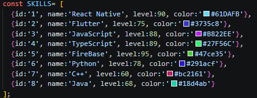
7. Membuat objek array SECTIONS untuk menyimpan riwayat pekerjaan
8. Membuat objek array SOCIALS untuk menyimpan link media sosial
Konfirmasi bukti SECTIONS
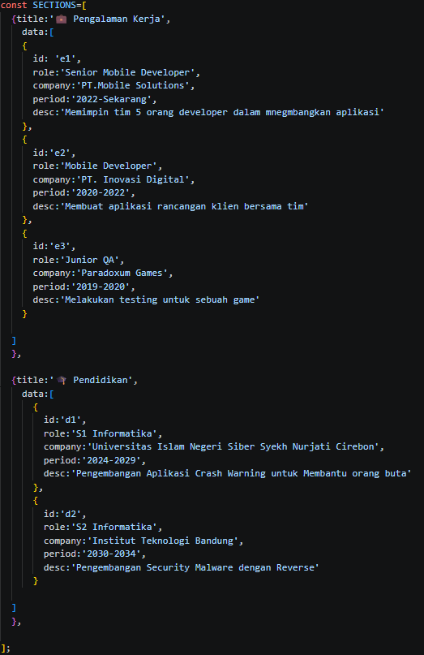
Konfirmasi bukti SOCIALS
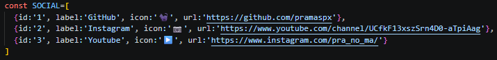
Langkah 3 : Sub-Components (SkillCard & TimelineCard)
konfirmasi bukti
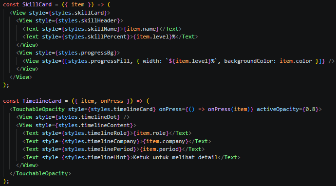

langkah 4 : State Management dengan useState
Konfirmasi bukti 
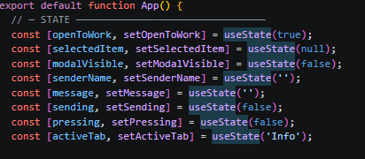
✅ Checkpoint: Aplikasi masih menampilkan teks, tidak ada error.

Langkah 5 : SafeAreaView, StatusBar & Header
Konfirmasi bukti
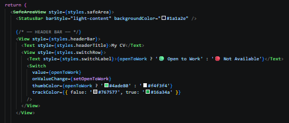

Langkah 6 : ScrollView & Profil Section (View, Text, img/image)
Konfirmasi Bukti
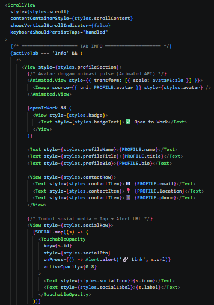

Langkah 7 : FlatList (Daftar Skills)
Konfirmasi bukti
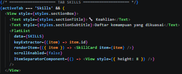
Langkah 8 : SectionList (Pengalaman & Pendidikan)
Konfirmasi bukti 
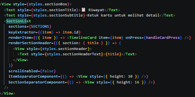
Langkah 9 : TextInput, Button & ActivityIndicator
Konfirmasi bukti
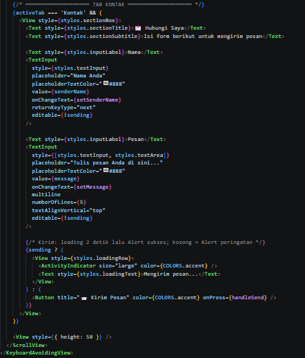

Langkah 10 : Modal (Popup Detail)
Konfirmasi bukti
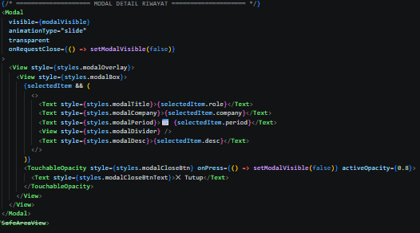
Langkah 11 : StyleSheet (Styling Terpusat)
Konfirmasi bukti
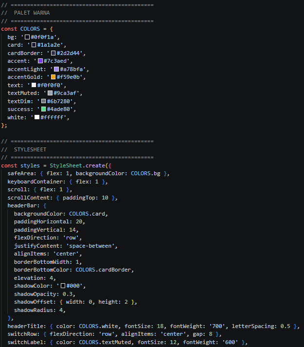
Langkah 12 : Verifikasi & Pengujian
Konfirmasi bukti
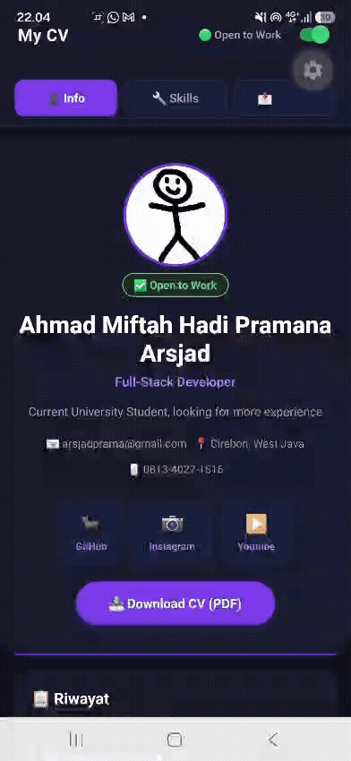